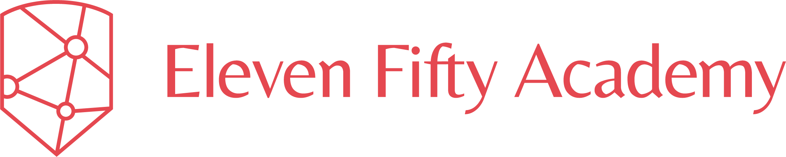

# Introduction

## Intro to Angular with C\# WEB API

#### An Extension of ElevenNote

**Angular, Material Angular, TypeScript**

### What is Angular?

Angular is a front end JavaScript Framework, built by Google. Angular practices the MVC \(Model View Controller\) design pattern. The definition from Google is—“Angular is a platform that makes it easy to build applications with the web.” The annotation that developers use for Angular is ‘ng.’ These names are synonymous with one another, don’t be too shocked to see the reference of ‘ng.’ The Angular documentation that will be referenced throughout this build is located here. It’s important to note that we are working with Angular 4, which is a whole different paradigm from AngularJS\(1.5\).

### What is Material?

Material is a library of UI \(User Interface\) components that developers can add to their web, mobile, or desktop applications for responsive styles. Google has created their own version of Material that complements the Angular framework. Learn more about Material Design here. The Material documentation that will be referenced throughout this build is located here.

### What is TypeScript?

Created by Microsoft, TypeScript is a superset of JavaScript, that compiles down to clean JavaScript. It allows developers to use static type annotations when developing JavaScript applications! TypeScript is almost like a blanket that wraps itself around JS, what this means to us— is that we can use JS conventions and easily mix it with the syntax of TypeScript. Learn more about TypeScript and how to use it in more ways than just with Angular. Refer to it’s documentation here.

### Topics we are going to cover

* Angular Folder structure
* Working with the Angular CLI 
* Material UI Design 
* Angular Forms
* Angular Router 
* Angular HTTP 
* Observables and RxJs 
* Authorization Guards

### Assumptions

This documentation assumes that you are already familiar with MVC design patterns, some JavaScript. Have worked with a UI framework such as Bootstrap, Foundation, or Materialize. That you are familiar with working with the command line enough to change and read directories. That you are familiar downloading development applications.  
Material Here are the project materials for this application:

### The Code repository

Here is the deployed version of the app Here is the Wireframe of the application build

The IDE \(Integrated Development Environment\) used in this build will be Visual Studio Code, Install it here

The command line prompt used is Powershell. Windows CMD and Mac Terminal works well too!

Google Chrome!

