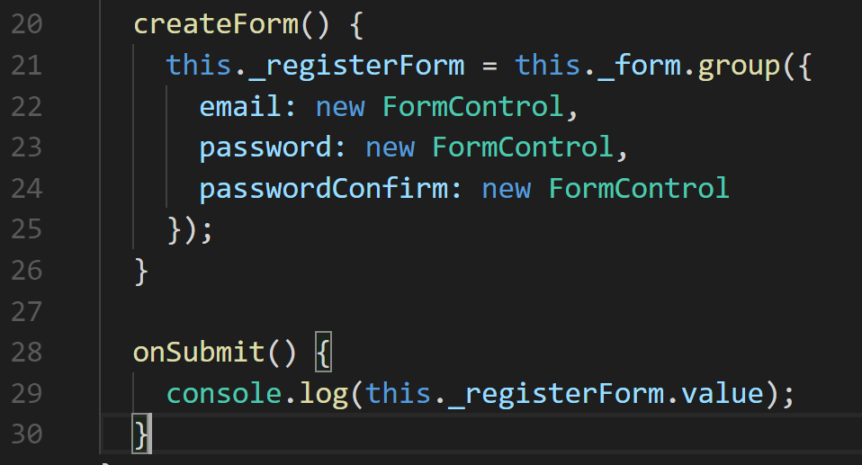

# Part 4: Building the Registration Page with Reactive Angular Form

In this module we will build out our Registration page. We will use forms to take in user inputs and control that data inside of the TypeScript file that comes with a built component. This file is also referred to as the controller, from here on out we will refer to it as such.

## Step 1. Generating the Registration Component

In the terminal, let’s generate our Registration component.

Type:

```text
ng g c components/registration --no-spec
```

Before we used the long syntax of **generate** and **component**. We can shorten that by using the **g** and the **c**. Also for the Angular CLI to generate a component without a test spec file, we can append the command **--no-spec**.


## Step 2. Importing Angular Form

Since we are essentially building a form that collects data, Angular has pre-built code that allows us to work with forms in an Angular fashion. A link to the documentation is [here](https://angular.io/guide/reactive-forms#introduction-to-reactive-forms).

Good thing about Reactive Angular Forms is that it’s built into the framework, have I mentioned that Angular is a [framework](https://stackoverflow.com/questions/148747/what-is-the-difference-between-a-framework-and-a-library).

First let’s import it into our project scope so that are application can work with Reactive forms.

Which files do we house all of our applications imports for our components to use? ....

**app.module.ts**, I knew you got that question correctly, because we have been talking about it so much— and we are going to do it a lot more.


We import **FormsModule** and **ReactiveFormsModule**. We will see how both of them help us when we build out the form itself.

To make sure that our components can use the modules we just imported, we include them, in the **@NgModule** Decorator, in the **imports** array. We are going to place them right underneath the **BrowserModule**. You’ll see why once we get close to completing our build.

## Step 3. Building Angular Form in our Controller

Now that we have Angular Forms imported, let’s build a form in our registration page, let’s head to our **registration.component.ts** file.

_Reason, so we are starting out our Form build first on the controller \(**registration.component.ts**\) side first, then we will head to the view \(\*registration.component.html\) to use the tools we create._

We first need to import three classes from our **Angular Forms Module**

* FormBuilder : Handles creating the form. Read more [here](https://angular.io/guide/reactive-forms#introduction-to-formbuilder).
* FormGroup : Binds all of the elements to one form. It’s a factory method of FormBuilder.
* FormControl : Inputs inside of the FormGroup.


We need to create a variable that holds the value of our **FormGroup**, so that our View will know what to reference when we create the input fields.

Inside of the class **RegistrationComponent**, we need a member variable for our group. Since we are using the luxury of TypeScript, we can also define what the type will be for type safety.

It’s important to think the intention behind our code. A question that we can ask ourselves is— _“Will this variable need to be accessible outside of this component?”_

The answer to that is no, it will not be. Why not protect it by using the private accessor keyword.


_It’s not important to use the underscore. It’s just an indicator that this member variable is \*private_.

Let’s build out a method that creates our form, we will call it **createForm**:


We need to create an instance of **FormBuilder** to help us build out this form. Inside of the constructor, we create a private variable that will be our **FormBuilder**.

Now inside of our **createForm** method we can construct our form using the **group** method that is apart of **FormBuilder**.

Then inside of the object that we pass to the group method we create 3 **FormControls**:

* email 
* password
* confirmPassword

Now that we’ve isolated our form creation to a method, let’s use that method to build us a form once the **constructor** first runs— by calling our method inside of the **constructor**.


## Step 4. Create the form in HTML with Material

Now that we have the form created in the controller side, now we need to connect our HTML side to this snippet of code.

Let’s head to the **registration.component.html**. Add the following form code:


This is the final code for our html page.

Let’s start looking into how we connect our HTML form to our controller file.

The connection occurs on **line 5**, when we use the syntax **\[formGroup\]**, we are accessing an attribute that ships with Angular forms.

The attribute allows us to connect the member variable of **\_registerForm**— which we created on in the controller file— to the form itself.

The `<mat-form-field>` comes from our material UI library. In order to use the form-field component, we need to include it into our **app.module.ts** file.

While we are at it, we will import the **MatInputModule** as well. Can you guess what that import is for? Here is a link about it here.

Back to our **registration.component.html** file, on line 5 we see that there are **parenthesis** around one word and **square brackets** around the other. Rule of thumb:

* Square brackets \[ \] = accessing items from the controller. 
* Parenthesis \( \) = binding items from the view. 


Lastly, let’s mention the **formControlName** on our input fields. The values for those are awkwardly similar to the form group we made in the **Controller**

RULES: Make sure that the spelling — including caps — is the same on the **controller** and inside the **formControlName**.


## Step 5. Create a Method that grabs the values from the Form

In this last step we will see some of the powerfulness of working with Angular Forms.

In order for our data from the input boxes to be sent somewhere we need two thing s in particular:

* A Button with the attribute type that has the value of submit.
* Then a place to send it to. Whether that is a url location, or in our case a method.

Remember this line of code from our view:


Inside of the **ngSubmit** for attribute, we set the value of a method called **onSubmit\(\)**.

What this does for us is that, once the form is submitted, the values that are currently inside of the input fields will be sent to this method!


We don’t currently have that method in our controller, so let’s create it.



In the **register.component.ts** file let’s create that form, then console log our member variable **\_registerForm.value** to see what we get in our view. For now we will call the component in the **app.component.html** file. Remember that we need to use the selector for the registration component with proper selector:


Then, when we run ng-serve we should see the form under the navbar:


Go ahead and enter some data, like in the screenshot above. Then, open Chrome Tools by using ctrl + shift + i. 

Click on the console tab.

Then, hit submit on the form.

You should see the following:


Awesome, so one bonus of using Angular Forms, is that the input bindings tack the values inside of them. Then they get appended to the form object that we create in our Controller. Now we can access those values by calling the property **value** on the **\_registerForm** variable that we created.

Note that if you’re getting a browser animations error in Chrome Tools, you can add it to your imports in your app.module.ts:


