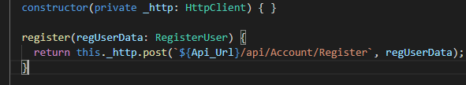

# Part 7: Communicating with Web API with Auth Service

In this next section, we will be talking with a DotNet **WebAPI** built in .NET. Before we use the our own APIs, we'll get some practice with  

Here is the link we will be using for our WebAPI endpoints:

[https://kcpelevennote.azurewebsites.net/Help](https://kcpelevennote.azurewebsites.net)

What is a service? Great question, read more in the link [here](https://angular.io/guide/architecture#services). In this part of the build, we will create a service that will communicate with our WebAPI specifically.

Strap in, [let’s do this](https://static1.squarespace.com/static/55f32473e4b029b54a7228d2/582b8a8fc534a5c177d16c67/582b8a9f2994cab6e0cdd61c/1479256368634/giphy-39.gif).

## Step 1. Using Angular CLI to build our Service

**Angular’s CLI** is very helpful in creating our components for us.

But what else can it do? The **CLI** can also generate our services for us!

In your Terminal. type the following, excluding the content in the parenthesis:

```text
ng g s services/auth --no-spec (Remember g stands for generate, and the s stands for service)
```


We created two things:

* A folder called **services** which is where all of our services will be.
* A file called **auth.service.ts** inside of that folder.

But you might have a **WARNING**, we will pick this up in the next step.

## Step 2. Continuing where the CLI left off…

The CLI was very generous in creating the **services folder** and our **auth.service.ts** file for us, but we need to continue with the setup from here. In order to add our service to our application, we need to go the **app.module.ts** file and include our **auth.service** in the **providers** array within our **@NgModule** decoration.

Why?...

Well, since in an Angular project can have multiple modules, Angular will not assume that you want to put your newly created service in the **app.module.ts** file.


## Step 3. Building Register Method then Making request using the built in HTTP Module

Now that we have our service, let’s add a [nice little](https://media.giphy.com/media/rYEAkYihZsyWs/giphy.gif) register method.  What this method will do is take in an object that has 3 properties:

* email
* password
* confimPassword 

Those are the properties that we ask for when a user is registered. Also the properties that our **WebAPI** is [expecting](https://kcpelevennote.azurewebsites.net/Help/Api/POST-api-Account-Register) to be inside of the request to be sent to the database. Note: If you have a username property in your .NET app for signing up and signing in, you'll want to include that on your own.

Our register method will need to send our data using an HTTP request to our API. We need to hold the never changing value of our API link. We will do that above the **@Injectable** decorator. Note, we will also start a register method under the constructor:

```javascript
const Api_Url = "https://kcpelevennote.azurewebsites.net";
```


## Step 4. Building out the RegisterUser Model

Create a folder within the **app folder** called **models:**


Inside of that file we are going to create a file called **RegisterUser.ts**. Note again: if you are needing a username variable to log into an app other than ElevenNote, you'll need to add that here. 

Right click on the new models folder and choose **add file.** 

Call it **RegisterUser.ts.**

Place this interface inside:


Back in our **auth.service** we can now make sure the parameter that we are accepting will have everything that is inside of our **RegisterUser** model by applying the type to the parameter. Note that you will need to import the RegisterUser model\(line 2\). Ctrl + . will do this for you.


## Step 5. Import HttpClientModule to our Application

Angular comes pre-built with it’s own HTTP method, Read more [here](https://angular.io/guide/http#httpclient).

We are going to include it within our application so that we can use it to communicate with our WebAPI.

In our **app.module.ts file**, import **HttpClientModule**, on line 5.:


Then let’s include it in our **@NgModule** decorator, within the **imports** property. Right above the **ReactiveFormsModule**.

Now we will be able to use it elsewhere in our application.


## Step 6. Injecting HTTP into our Service

To be able to use all the properties and methods of **HttpClientModule**, we need to [“inject”](https://angular.io/guide/dependency-injection-pattern#the-dependency-injection-pattern) an instance of it inside of our **auth.service** constructor. Let’s navigate back to our **auth.service.ts** file.

We create an instance of HTTP by assigning it to a private variable— we could use the accessor method of public as well, but since this variable will not be accessed to any other component we will keep it private.

Then we can refer to it inside of our register method by using our keyword **“this”**.

Once we call the assignment operator after our instance variable we see the list of methods and properties we can chain next.

Since we are sending information to the WebAPI, which HTTP verb will we use?

Post!

Now we can finish off with building our Post Request to our WebAPI.




Notice the **back-ticks around the url**. These aren’t quotes!. They allow us to utilize **string interpolation**. So we can use our variable that we’ve created above in line without using the **+ operator**


## Step 7. Using our Register Method in our Register Controller

Now that we have the **register** method created in the **auth.service.ts**, let’s put it to work!

In our registration controller \(**registration.component.ts**\), we have an **onSubmit\(\)** method that is just returning a **console.log**.

This is where we are going to use our **register** method. Now for us to have access to that method, we first need to “inject” an instance of the Auth Service.

Inside of the constructor is where that happens.


Since we have an instance, we can include it into our method **onSubmit\(\)**.


Try to register with the app now, and look inside of the console in the browser and you should see you did it!.


