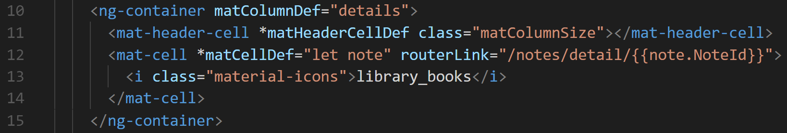
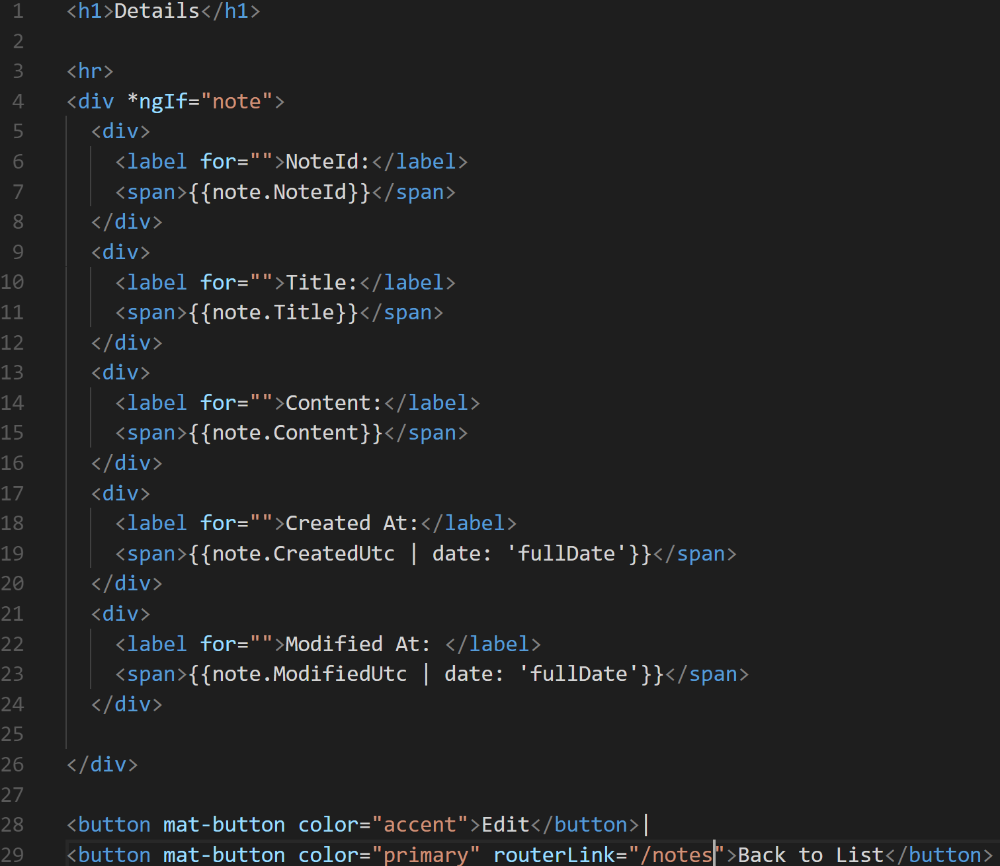

# Part 13: Creating Note c.R.u.d. — Read

In this module we need to read one individual note. Let’s make that happen. Let’s create our component using the Angular CLI.

Type

```text
ng g c components/note-detail --no-spec
```

## Step 1. Note Service

We have no need to import any classes to our service because we’ve done that in the past module, [yes](https://media.giphy.com/media/89x4osEodHEoo/200w.gif)!

We just need to create a method that accepts an **id**, and then returns us a one note, by that particular **id**


Boom magic. _not magic, but you see where we're going_

## Step 2. Setting up the form in the Note Details Controller

How are we going to get the id of a note? Let me rephrase Where are we going to get the id of a note?

The answer to that comes from our **note-index.component.html**.

Where the **library\_books** mat-icon lives let’s include a **routerLink** that includes the id of the particular note.



We will add the path and connect it with our NoteDetailsComponent,

The **:id** is a **URL** param that we can include in to our build **URL**, so we can save the data of that **id** to pass it to the new view.

We will then be able to retrieve the specific note based on that **id**.


In our note-details.component.ts file, we can now access that URL param. Let’s make use of the ActivatedRoute class to do that.

ActivatedRoute class specifically communicates with the current web page our browser is currently on. There are associative methods that are built with the specific page to get details off of it.


Let’s inject an instance of the class and use the **paramMap** method.

Go to your application in the browser, and on the note index page, click on the library icon. Then open up the console window you should see the data from your route. 


Now that we know we can get this data from the route, let’s inject our **notesService** and make a request to the **getNote\(id: string\)** method.


## Step 3. Creating the HTML for the Note Details

We need to show the data in our view now that we have the note from the API.



