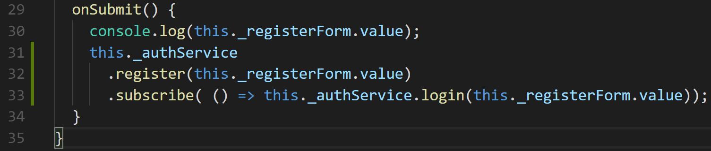

# Part 8: Logging in with a token

We expect as humans who have registered into any website ever, to already be logged in. But that’s not the case with our WebAPI. When we register— we did indeed that— just register. So we need to then, login our users, then navigate them to another page to signify that they have successfully logged in.

## Step 1. Setting up the Login Auth Service method

What is the purpose of our Login method?

The way that the WebAPI is created if to send request for our notes CRUD functionality our request need to have a **Bearer Token** appended to the **Headers** of the request.

For us to get the **Bearer Token**, we need to send a request to the **/token** route with information — i.e. a user’s email, and password.

What type of request do we need to send to get our token back? Let’s look at the WebAPI documentation [here](http://kcpelevennoteapie.azurewebsites.net/swagger/ui/index#!/Auth/post_token).

Post type! We see in the link above that we need to send a string with a particular ‘**grant\_type**’ then a user’s **email**, and **password** in the body of the request.

Let’s create that string inside of our login method in the **AuthService.ts** file,


_\*Take note of the backtick usage when we create our string_

What is that **encodeURl\(\)** doing? Read more about them [here](https://developer.mozilla.org/en-US/docs/Web/JavaScript/Reference/Global_Objects/encodeURI).

Essentially, we are making sure that any user data that has special character is configured to be sent across the interwebs

Now we can build out http post request. After we create our string:

Type:

```javascript
return this._http.post(`${Api_Url}/token`, str);
```

With a post request, we not only want to include the particular URL, but we also have to send information in the body of the request. We do that by sending that as the second argument in the post method.

After we send the post request, what we assume to happen is that the WebAPI will send our token back. But how to we “**listen**” for the information that gets sent back?

## Step 2. Observing an Observable

So if we hover our mouse over the post method, we see a bit of information. I want to highlight what is at the end of that info. And that is `Observable<Object>`.

What is an **Observable**? Read more about them [here](http://reactivex.io/rxjs/class/es6/Observable.js~Observable.html).

The technical definition is: _**A representation of any set of values over any amount of time**_.

[Wut](https://media.giphy.com/media/zjQrmdlR9ZCM/giphy.gif)?

Essentially, it’s like a stream of data, that if at anytime that data changes, the method then receives the new incoming data— I hope that makes [sense](https://media1.tenor.com/images/5ac8c9e715050ef19d695fd9d0ea5d99/tenor.gif?itemid=3475991).

If we want to have access to the data that an **Observable** returns we need to **subscribe** to it!

Well how do we do that?

Well the good guys at **RXJS**— the creators of Observables— gave us a method that we can call on any Observable, called **subscribe\(\)**.

Since the post method is an Observable, let’s subscribe to the data that is coming back. Then we will hold the data in a variable called **token**.

Then for the time being, save it to our browser's **localStorage** by using **localStorage.set\(\)**


## Step 3. Creating a Token Model

We need a way to capture the values that are coming off of the data from our **Observable**, the way that we are going to approach this is by creating a model that will hold a template of the incoming values.

Inside of the models folder, we will create a new file called, **Token.ts**.


From the documentation that we have for our WebAPI, we can see the values that will be coming from it are these fields.

Now that we have collected this template for are data we can use it in our **login** function \(**auth.service.ts**\). You should be able to press **ctrl + .** and it will bring in the import for you.

## Step 4. After Registering, Logging in our Controller!

We have our login function built, now let’s implement it!

In our **registration.component.ts**, in our **onSubmit** method, we call our **auth service** with the **register** method.

The beauty of the **register** method, it’s an **Observable**! This means that after we register a user, then, we can also log them into our application and receive an **access\_token** back.

Do you remember which method we can call on an **Observable** to listen for an action?

**Subscribe**!



Now we aren’t going to work with any data that is coming back from the **Observable**, we want to just run another action. So we don’t need to create a value to store it.

