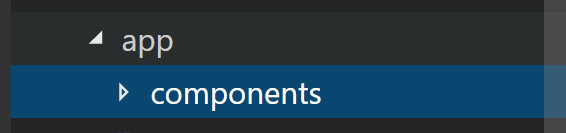
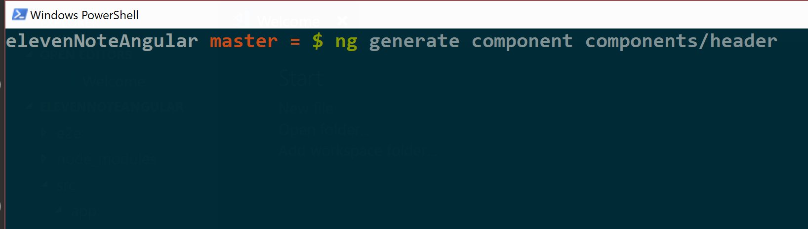
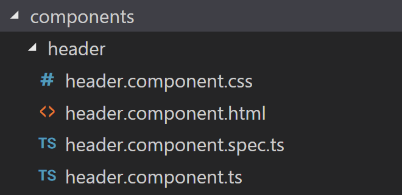
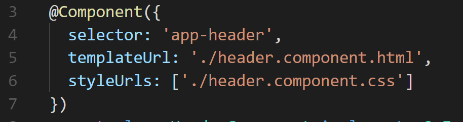
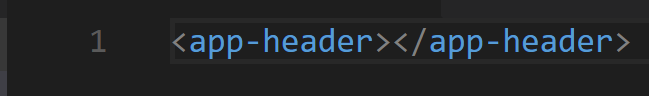
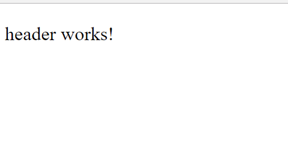

# Building out the Header Component
In this module we will be focusing on building out the angular component using the Angular CLI.
### Step 1. Create a component file 

We want to organize our application so that we can have a hub for all of our components to be stored. 

Inside of the **app** folder, create a new folder called **components**.

This is where we will be building all of our components from here on out. 

### Step 2. Generate header component 

In the Terminal, let’s build out the first component — Make sure you are in your application directory!

Type:
```shell 
ng generate component components/header
```


That command scaffolds out a component in the file location that we include at the end of the file by saying **“components/header”**. 

We should have a **header component** in our **components** folder now.

When we use the Angular scaffold it gives us four files. 



But also it modifies another file, the app.module.ts. It Includes our newly created component into the declarations key as one of the array properties. 

### Step 3. Delete the Spec file 

Unit testing is out of scope for this application but it’s a great and significant practice, read more here. So we are going to delete that file (header.component.spec.ts) for now, and actually we will see how we can generate our future components without generating the test file. 
### Step 4. Showing our Component 
Now that we have our component, how do we make it show on our web page?

Let’s take a look at the **header.component.ts** file, the start of our answer begins there. 



In lines 3 - 7 we have this **Component Decorator**. This decorator houses the settings of our header component. 

**Selector**— This is what Angular will know our component as if we include it in other places in our application.

**TemplateUrl**— This is how our html file is connected to this component. This connection is very important, because this is how we will exchange data from our view (html file) to this one. 

**StyleUrls**— This is how we also connect CSS files to the html page. *Notice the square brackets, that indicates that we can include multiple stylesheets! 

Let’s get to seeing our component on a web page. 

First, run the application with: 
```shell
ng serve -o 
```
_(before we used --open, but now we are using the shorthand)_

   
We should just have an awesomely blank page (that’s why there isn’t an image, ain’t nobody have time for that)

Keeping the browser open in the background. Let’s show our component!

In the **app.component.html**, add 
```html
<app-header> </app-header>
```


Now, after saving it navigate back to the browser and we should see this:




```html 
<app-header> </app-header>
```
is known as a **Component Directive**.

Notice, that component directives look like a markup language that we are familiar with, can you guess… that’s right HTML!

We have finished building out the header component! Before we make it look like a header, let’s include our style UI library **Material**. 