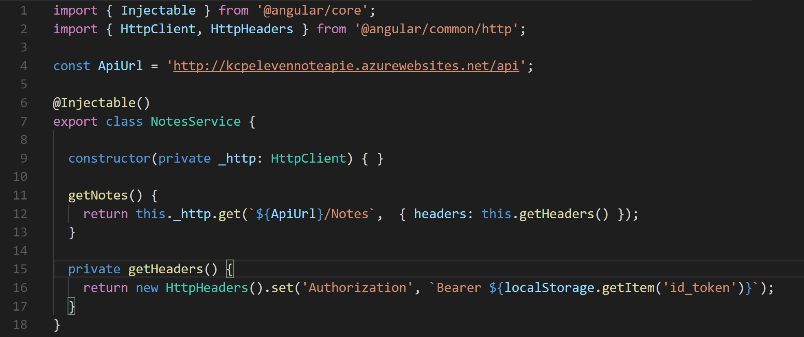

#Building the Note Index page

For the next couple of modules we will be focusing on working with just our notes! Finally. 

## Step 1. Grab Notes from WebAPI through the Notes Service

We need to set up the [communication](https://media.giphy.com/media/vIg5t0KHYqgE0/giphy.gif) to our Notes endpoint for our WebAPI. Using the Angular CLI let’s generate a service.

Type: 
```shell
ng g s services/notes --no-spec
```


Remember with generating a service we also need to place it in our **providers** property that is located in the **@NgModules** decorator in the **app.modules.ts** file.

Now let’s inject our **HttpClient** class into our service and make a **getNotes()** method in our **NotesService**.


Remember that if we are trying to retrieve notes from our [api](https://kcpelevennote.azurewebsites.net/swagger/ui/index#!/Notes/Notes_Get), we need to be authorized. We were able to store our accesstoken in the localStorage so let’s grab that and also create a private method that gets our headers

_*Don’t forget the imports! If you type out the code first you can press **ctrl .** and VSCode will try to bring in that class for you. _

Here is the final code. 



## Step 2. Create a new Note Index Component

With the Angular CLI lets generate a node index component. 

Type: 
```shell 
ng g c components/note/note-index --no-spec
```

Notice we are making a folder for all of our soon to be note components.

Inside of the **NoteIndexConponent** constructor, let’s bring in the notes service as a private method. 

## Step 3. Using our Note Index Controller to get our notes

A Note type! Have we created one? Nope so let’s create one. 

In the models folder create a new file called **Note.ts**.


Now the question mark on the variables mean that _these values are optional to a note’s creation but we want to be able to access them._

We can now use this type in our note-index controller. 

Then we need to call our getNotes() method from our NotesService and subscribe to the data that comes from it. 

Remember Observables? If not take a gander at [Module 7](module7.md)


## Step 4. Setting up the Material Table that holds our data 

To present our notes to the view we will put it inside of a material table. But first let’s create a route path that is pointed to our notes index.


Now let’s set up the table. 

Take a few minutes to read the Material Documentation on tables [here](https://material.angular.io/components/table/overview).


## Step 4.1 Getting the dataSource in the NoteIndexController 

We will create an array for all of our column names for our table.

Type:  
```js 
columnNames = ['details', 'NoteId', 'Title', 'IsStarred', 'CreatedUtc', 'buttons'];
```
Then we need a member variable for the dataSource to pass the data to the table.

Type, 
```js 
dataSource: MatTableDataSource<Note>
```

Next we need to import **MatTableDataSource** from **material**, this is going to be the structure that gives our table it’s data.

Now, we need to create an instance of this class with the note data that we get from our service. Inside of the subscribe method we can do it there. 


## Step 5. Building our Note Index HTML

We can start building the view, but first let’s import **MatTableModule** into the **app.modules.ts** file, then include it under all the other **Material Modules** that are located in the **import** property.


Along the lines of setting things up, let’s link Material Icons. In the **index.html** that is in the **src** folder, under the fonts

Type: 
```html
<link href="https://fonts.googleapis.com/icon?family=Material+Icons" rel="stylesheet"> 
```
Back in the **note-index.component.html**, we can start building out the view 

The next step in creating the table is,  defining the header-row and the row. 


What does the * mean, read about it [here](https://angular.io/guide/structural-directives#prefer-the-asterisk--syntax).

We tie the dataSource for the table with the one from our controller. Then also, we connect our column names from the array that we create in the controller as well. 

The premise of making a table this way, is to let the data automatically add itself to the rows in the table. We are creating place holders for that data to go. 

Next we need to place the data for the columns. 

Before we do let’s take an example and walk through a bit of what will happen.


Using the ng-container, this Structural Directive’s job is to contain a group of elements that will have connection to data that is created in our controller, read more [here](https://angular.io/guide/structural-directives#group-sibling-elements-with-ng-container).

Now we first define which column this data will be apart of with the **matColumnDef** attribute. 

Then for the tippity top of the table, the name that will be in the heading is located in the **matHeaderCellDef** attribute.
Lastly the data that will be in the individual cell is then apart of the **matCellDef**. We create a placeholder for the value with let note and we can grab a property in that note object, that happens inside of the double curly braces.

Let’s create the rest of our data. 


_*Pro tip, once you create one ng-container, copy and paste is your friend._ 

We will also want to redirect our user to this page when we login or register, so we’ll need to change the .navigate methods in our authService. 


Here’s what we should have so far— I have a user created and I’ve added notes from postman just to show off the table. 


We currently should have an error— if you click on the star, then it should say that isStarred is not a function, that’s fine we will fix that later with a challenge
