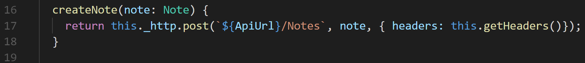
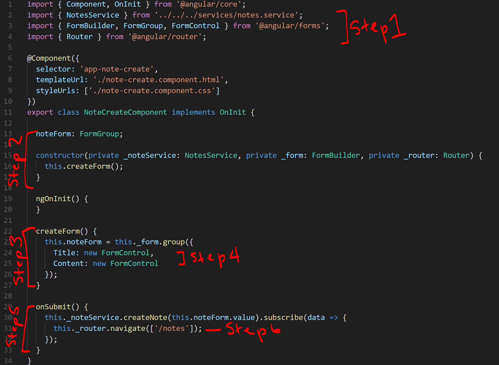
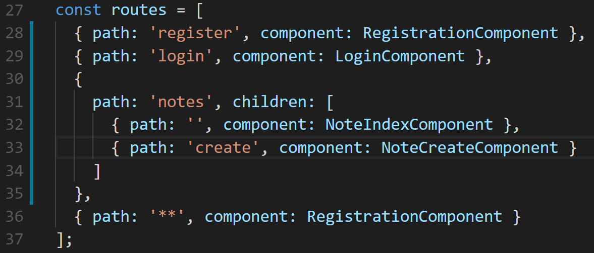
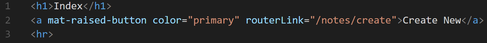
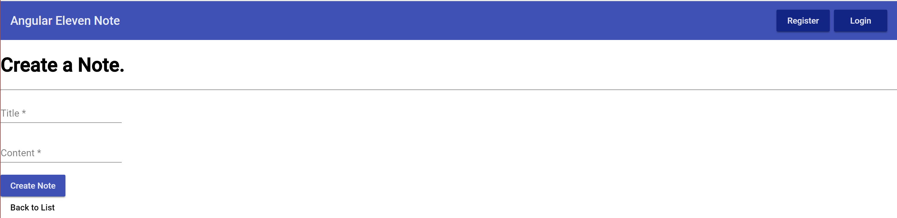

#Creating Note C.r.u.d. — Create 

Setting up the service is done! Now we need to knock out all of our CRUD (Create, Read, Update, Delete) actions. 

## Step 1. Note Service 

Which http verb sends data to our backend server? **Post**!

In the **note.service.ts**, we will create a new method called, **createNote()**. The **createNote()** method will take in one parameter, the note, then run a http post to send the data.

_Don’t forget the Authorization for the header!_



## Step 2. Setting up the form in the Note Create Controller

Using the Angular CLI, let’s build a note-create component, 

Type:
```shell
ng g c components/note/note-create --no-spec
```
In the controller, create an instance of the **NoteService** and then inject it to the **note-create** constructor. 

The purpose of this component is for users to build a new note, so they will place information within form field and then submit the data. 

We will need to:

 - Import our form tools
 - Inject FormBuilder in the constructor
 - Create a method to create the form
 - Figure out what fields we need from our API Docs  
 - Create an onSubmit() method 
 - After a successful submission send the users back to the user index. 



## Step 3. Creating the HTML for the Note Create

With our view let’s create the form users will see, 

Our form mimics what we’ve created in the login and register pages. 

Using the **required** keyword as an attribute, we can make sure that data is given— and if it’s not— don’t allow the form to be submitted. 

That gives us a wall, of protection for our form! On the view side. There are multiple points we can place walls, the first line (or last line, depends on how you write your code) of defense is on the view side.

```html
<h1>Create a Note.</h1>
<hr>

<form #f="ngForm" (ngSubmit)="onSubmit(f)" [formGroup]="noteForm">
  <div>
    <div>
      <mat-form-field>
        <input matInput placeholder="Title" formControlName="Title" type="Title" required/>
      </mat-form-field>
    </div>
    <div>
      <mat-form-field>
        <input matInput placeholder="Content" formControlName="Content" type="Content" required/>
      </mat-form-field>
    </div>
  </div>
  <button mat-raised-button class="nav-btn" color="primary" type="submit">Create Note</button>
</form>

<a mat-button routerLink="/notes">Back to List</a>
```

## Step 4. Adding the Path

We need to add the create page to our path in the **app.modules.ts** file. Let’s first organize our paths for the next incoming components. 

Since all of our note components share the same idea ‘notes,’ we can have child paths that will be our components. So, instead of this:

```js
[
    { path: ‘notes’, component: NoteIndexComponent },
    { path: ‘notes/create’, component: NoteCreateComponent },
    { path: ‘notes/:id’, component: NoteDetailComponent },
]
```
We can have this...
```js
[{ path: ‘notes’, children: [
    { path: ‘’, component: NoteIndexComponent },
    { path: ‘create’, component: NoteCreateComponent },
    { path: ‘details’, component: NoteDetailsComponent },
]},
```
Makes for clearer paths as we scale to larger projects.

Now that we have this path created we can include a routerLink in our note-index.ts file where the pencil currently is located:





We should now have access to the create page:




After submitting the form it should also redirect us back to the index page. 
