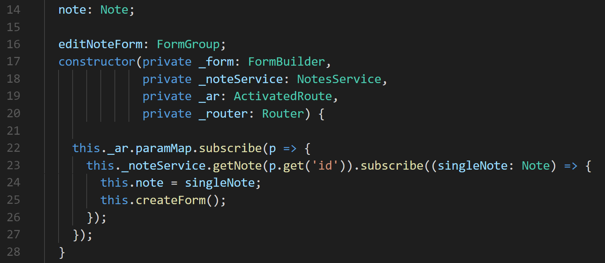
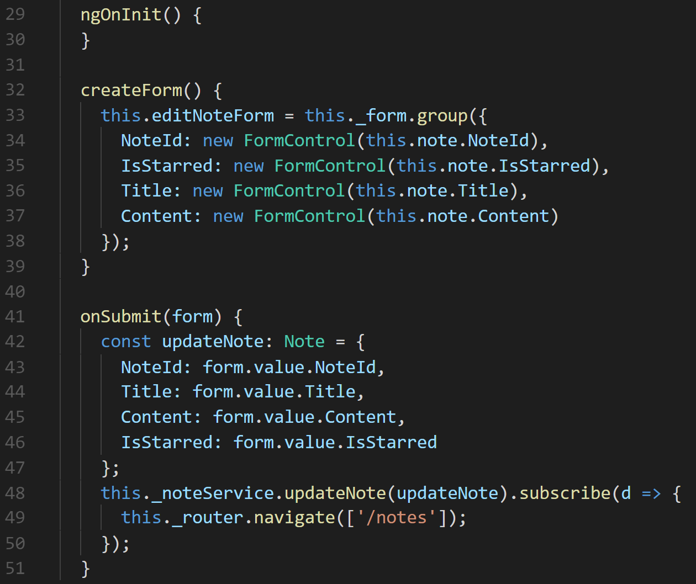
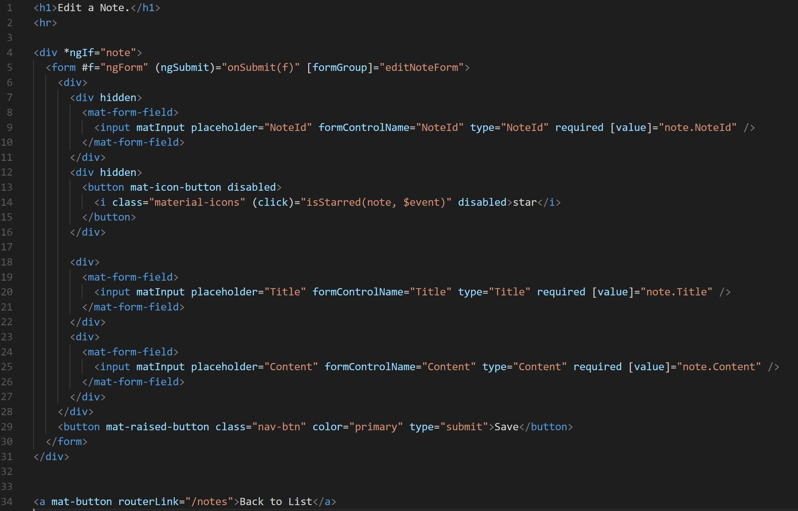

# Creating Note c.r.U.d. — Update 

> Update! We are [halfway](https://media.giphy.com/media/E4fUN2Qk1Af5u/200.gif) there. Let’s create the note-edit component from our Angular CLI. 

Type:
```shell
ng g c components/note/note-edit --no-spec
```

The update action always involves two http methods, the **getNote()** by id, the the put method that changes the value of that note. 

## Step 1. Note Service 

The edit note method will mimic our create note method. We have to pass in the full note to the method so it can save the old and the new changes. 


## Step 2. Setting up the form in the Note Edit Controller

Here in the component we will combine ideas from our **note-create** and create a form, and the **note-details** and grab the note by id through the **URL** params



Then we will create the createForm() method, and then we will pass in the current values of the things we are changeable, so we can see our content in the fields 



Finally, create the **onSubmit()** method that calls our **updateNote()** method with the note given.

## Step 3. Creating the HTML for the Note Edit

Since we have a form for our edit page, the **HTML** will look addly like the note-create. Except we will have to include the values that are currently set for the:

- Note id 
- Note title 
- Note isStarred 
- Note content



We made the **NoteId** and the **Star** hidden on the page, and i’ll explain why.

When updating the note we need to include the id because that is a value that should not change. For users not to be able to change it we can hide the field. There are other ways of doing that, but we will go with this for now. 

Then with the star, it will be changed on the note index page, but just in case you as the developer want to add the ability to the edit page we added that functionality in. 

## Step 4. Finishing the path in the NoteIndex

To get to the edit page let’s include the routerLink in the **note-index** page


## Step 5. Challenge Make the star clickable!

The goal of this challenge is to test yourselves on the the *ngIf directive. For this challenge you have some practice with this **attribute directive**. But some knowledge might be new to you so test yourself!

Visit the docs about the ***ngIf** [here](https://angular.io/guide/template-syntax#ngif) and come up with your own solution. 

If you missed the documentation over the asterisk that is prepended on the attribute Directives, read more [here](https://angular.io/guide/structural-directives#prefer-the-asterisk--syntax).
 

Take no more than **45 minutes** on this challenge but allow yourself to struggle with it for a bit. 

## Step 6. Challenge answer

[TODO](https://media1.giphy.com/media/3o6fIUOohyg4yegu1G/giphy.gif)