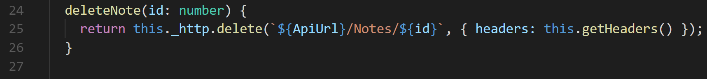
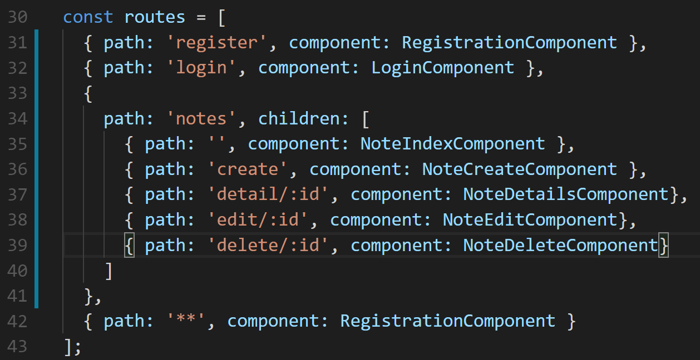
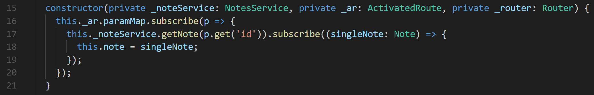
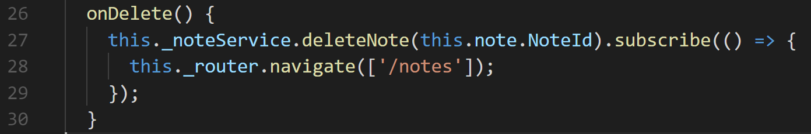
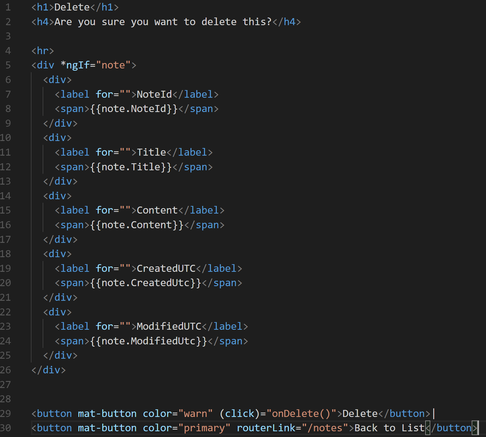
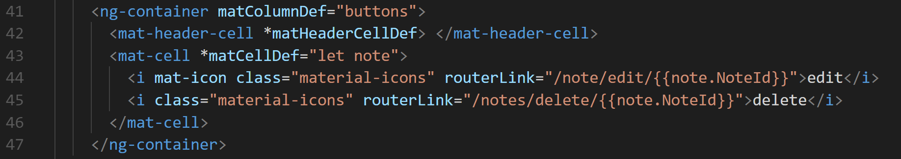

# Creating Note c.r.u.D. — Delete 

The last of the crud, to create the Delete [action](https://media.giphy.com/media/26xBIUj4Y6K2LcIz6/source.gif). Using the Angular CLI create the note-delete component. 

Type: 
```shell
ng g c components/note/note-delete --no-spec
```

## Step 1. Note Service 

Like always we will start at the **NoteService**, we will create a **deleteNote(:id: number)** method, and we will pass in the id of the note that we would like to get rid of. Based on our docks [here](http://kcpelevennoteapie.azurewebsites.net/swagger/ui/index#!/Notes/Notes_Delete).



Let’s add the path to this while we are at it, in the **app.modules.ts** file



## Step 2. Setting up the form in the Note Delete Controller

In our **controller**, there are going to be similarities between our **note-details** and **note-update**, and that’s getting the id from the params of the **URL**

In our constructor we will just copy and paste. 



What will be new is how we delete the note. We are going to do it through a button click action, so we will need a **onDelete()** method that calls our **deleteNote()** service method.



## Step 3. Creating the HTML for the Note Create

Let’s present the data to our users, which looks just like our **note-details** component view, so another copy and paste job.



Step 4. Finishing the path in the NoteIndex

Next we will add the **routerLink** to the **delete icon**


