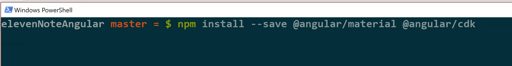
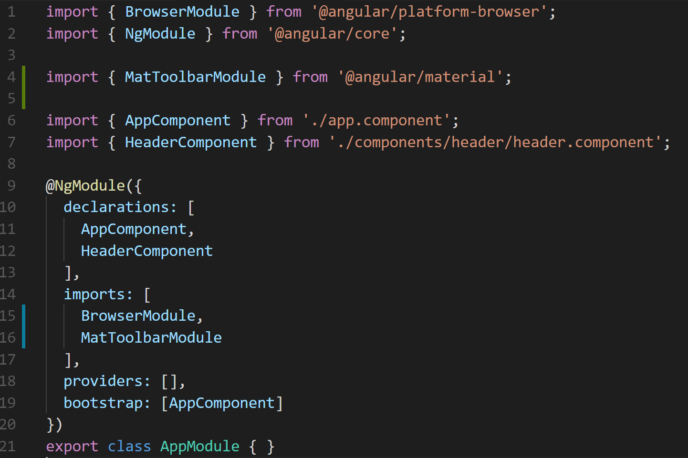
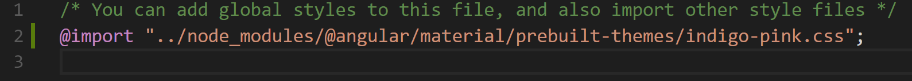
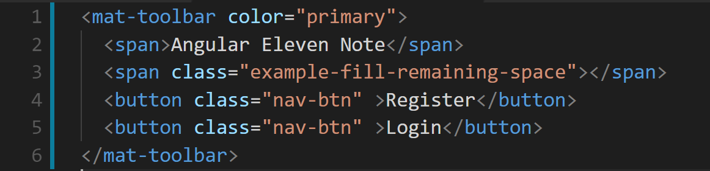
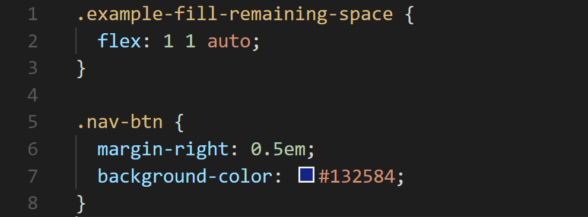
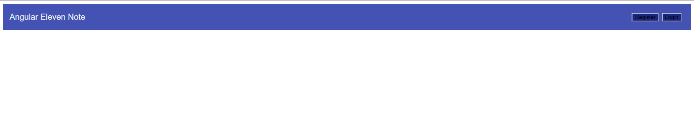
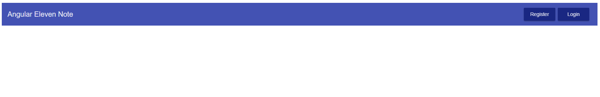
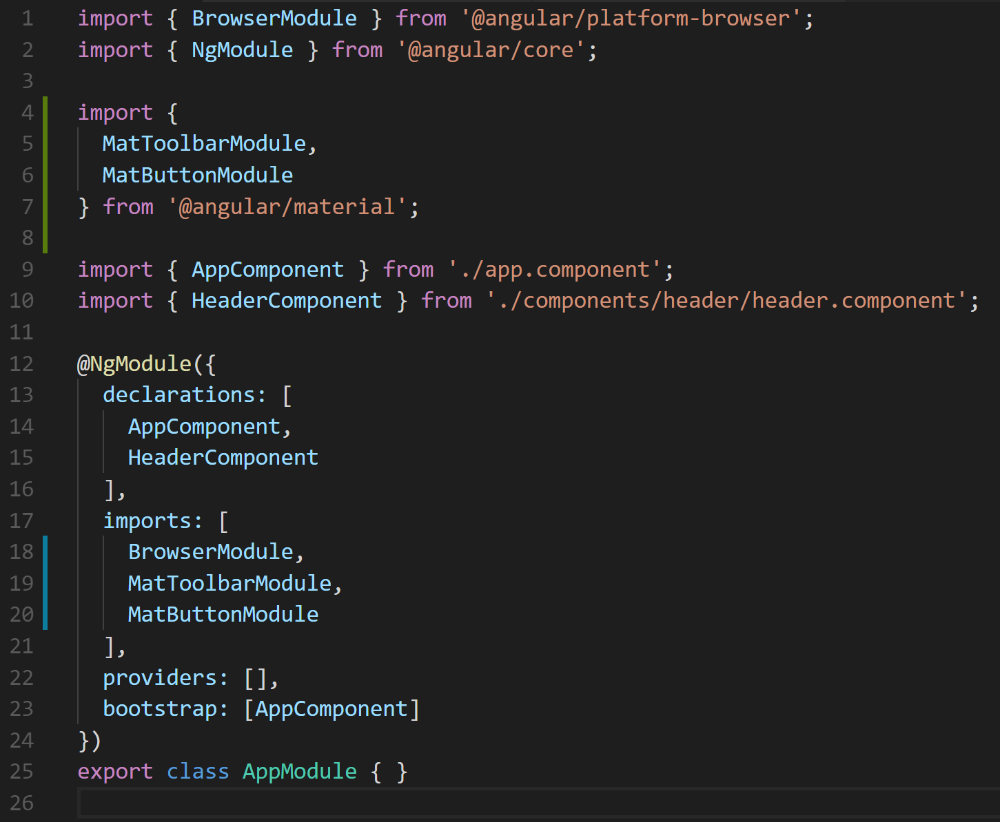
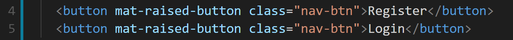

#Sprucing up the Header Using Material
In this module we will walkthrough how to incorporate Material UI tools into our Angular application. Then we will style up our header! Visit the Material site here.
## Step 1. Install the Material and CDK
In order for us to use Material in our Angular application we need to first install it from our **Terminal**

Type, 
```shell
npm install --save @angular/material @angular/cdk
```


There is an intentional space between the **@angular/material** and the **@angular/cdk**, this allows us to install multiple applications at once. 

Now that those libraries are finished installing, we need to include them into our application. For these to be included we need to add them to the **app.module.ts** file.

## Step 2. Import Material into our application

Do you remember what the **app.module.ts** file does? If not take a look back here.
##TODO add Link

We need to import the specific Material component to add to our application, here is a list of components that can be imported [here](https://material.angular.io/components/categories).

We are going to be using the [Toolbar](https://material.angular.io/components/toolbar/api) first, so let’s import that right under the **NgModule** import

Type:
``` js 
import { MatToolbarModule } from ‘@angular/material’; 
```
Then in the **imports** array within the **@NgModule** decorator, include the **MatToolbarModule** under the **BrowserModule**.

Here’s what the **app.module.ts** file should look like:




Finally, we need to include a theme to our application so Material knows which styles to pull from. Material gives developers the option to create their own custom themes. That is out of scope of this application, read more about them, and pre-built themes [here](https://material.angular.io/guide/theming).

Inside of the **styles.css** file — it’s located in the src folder. We need to import the theme inside of this file. 

Type: 
```css
@import “../node_modules/@angular/material/prebuilt-themes/indigo-pink.css”;
```


## Step 3. Using MatToolbar Material Component

Inside of our **header.component.html** file we can now use the component directive for the **MatToolbarModule**, which is ```<mat-toolbar> </mat-toolbar>```.
Using this directive, we create a Material Toolbar, Let’s add some more code in **header.component.html**.



The **color** attribute communicates with the styles that we imported inside of our **styles.css** file. For this pre-built theme, the primary color will be a blueish color. 

In order for our buttons to be on the right side of the header, we are going to create a class in the CSS that fills empty space.

Take a look at your web page. Now, none of the classes have been created just yet, so there isn’t anything changing our HTML element styles just yet. But we should see the blueish color!

## Step 4. Styling up the Header component with CSS

Let’s finish up by adding the CSS to our header component. Inside of the header.component.css file, add this code:



Take a look at your web page after saving, 


Our buttons are pretty ugly…

## Step 5. Challenge: Style buttons using Material Button Component 

Let’s have a challenge, we want to be able to use the Material Button Component from Material. Using the documentation [here](https://material.angular.io/components/button/overview). Make the buttons on the header look like this example:

 

The answer will be in the next step, but this is a chance for you to challenge yourself and grow. Give yourself maximum of **30 minutes** to attempt this challenge. Start the clock!

## Step 6. Challenge: The Answer

In order to add the Material button style, we first need to include the **MatButtonModule**. This button module allows us to have access to quite a few attribute directives such as: 

 - mat-button
 - mat-raised-button 
 - mat-icon-button 
 - mat-fab 
 - mat-mini-fab 

For our challenge answer we are going to use the **mat-raised-button**.

Let’s start at the **app.module.ts** file and import the **MatButtonModule**, then include it within the imports of our **@NgModule** decorator.



After we imported the Material button, we can now include it on a HTML button element as an attribute directive.

Inside of our **header.component.html** file, we will add **mat-raised-button** to our buttons:




Voila!
