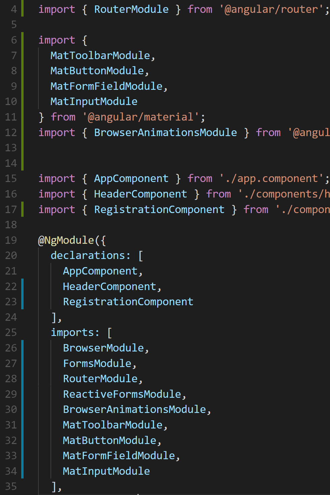
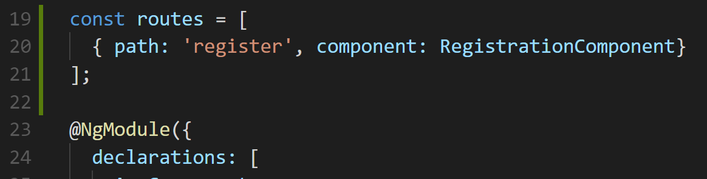
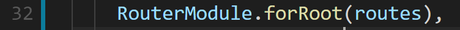
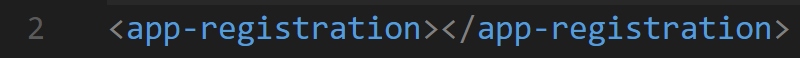
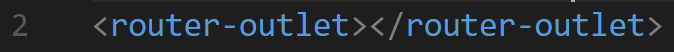
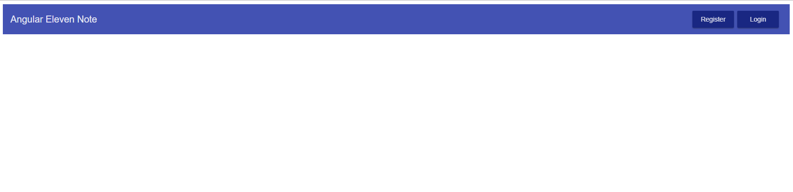
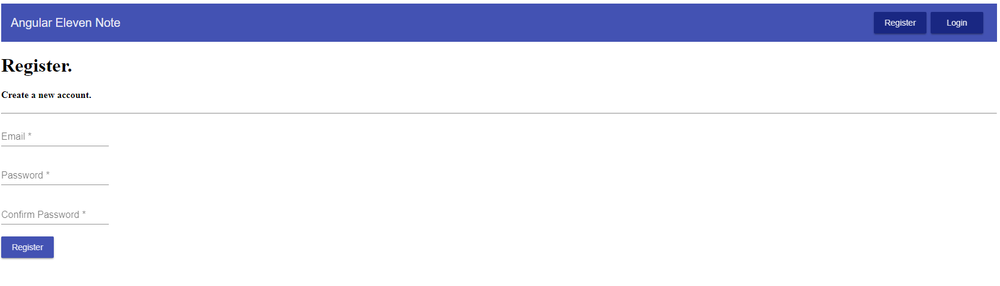

# Routing with Angular Router

We are rolling now with development! This is a good time to take a step back and start setting up routing in our application.

Our intention for adding in Routing to our application is that we, first want different components to display on different pages. Secondly we ultimately would like to have notes to only be viewable for a particular user when they login/register. 

Angular Router will help us out with both of these instances. 

To read more about Angular Router visit [here](https://angular.io/guide/router).

## Step 1. Import Angular Router

Just like all things, if we want to use it inside of our components we first need to import it in our **app.module.ts** file. See Line **line 4** in the image in the next page. We will use our import statement, to import **RouterModule**.

Then also, we will add the module to our imports on **line 28** right below our **FormsModule**. 

I’m sure you’ve already noticed the placement of our modules, we are keeping **angular modules** above the **material modules**. 

## Step 2. Start Building paths 

Now that we have Angular Router imported into our application, we are going to build out the paths each of our component here on out will live.



Since there are going to be multiple paths in our application, the way we can represent that is inside of an array. 
Let’s make a routes array that is going to collect all of our routes. Above the **@NgModule** decorator,

Type:
```js
const routes = []
```
A route will be an object that consist of a couple of properties, but the 2 we will focus on now are:

- Path, read more about Path [here](https://angular.io/guide/router#configuration). 
- Component, read more about Component [here](https://angular.io/guide/router#configuration).

How the path will look is like this: 
```js
{ path: <appending url link>, component: <name of component> }
```

Let’s make a path for our register page.




Next, we need to make sure that the **RouterModule** is built with our register route that we just created. 

How do we do that? If we look at this link [here](https://angular.io/guide/router#configuration), we see that on our **RouterModule** in our decorator with a method called **.forRoot()**. To be clear, the following addition is made inside of the imports array at the end of the RouterModule that you just added to the import



## Step 3. Including router-outlet to show our paths 

Okay, now that we have our router imported and a route configured, we now need a spot in our code that renders out the output of our desired route. 

That’s where the **router-outlet** [component directive](https://angular.io/guide/attribute-directives) comes in. 

Let’s include it in our **app.component.html** file. We are going to remove the **app-registration** component directive and swap it out with our **router-outlet** component directive(on the right below) 





Now if we go back to our browser and check on our application, we see…



That’s right a whole bunch of nothing! 

That’s because we are currently at the url of, http://localhost:4200.

But what happens when we go to the **/register** route at, http://localhost:4200/register …


Boom! Magic… Well not magic, because you just saw how we’ve created this. 

## Step 4. Challenge, Make any other route target our register component

Our goal for this challenge is to create a path that catches any link that we did not create, it will automatically take a user to the register page. 

**_*Hint, take a look at this link and notice what Angular does does for routes that doesn’t exist, [here](https://angular.io/guide/router#configuration)_**

Angin the purpose of the Challenge is to test yourself take a glance at the challenge first and if you're spinning more than 15 minutes, take a gander at the answers in the next step.

##Step 5. Challenge Answer

The Answer to the challenge above is include the double asterisk as the path and for the component, we need to include the **RegistrationComponent**.




Usually we would see a **PageNotFoundComponent** here. That is out of scope for this application, but I implore you to challenge yourself further and build it. 
