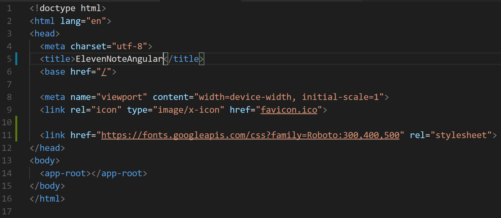
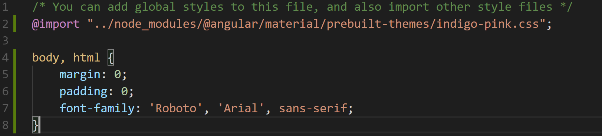

# Design Break: Fonts

We’ve been working pretty extensively with **HTML** and **TypeScript**. Let’s have a small break and work on a few **CSS** needs.

Using the **Material UI**, there is a font family that goes really well with this library and that’s **Roboto**— read more [here](https://material.io/guidelines/style/typography.html). Let’s walk through including the font into our CSS. 

## Step 1. Adding the Google Font Link

Inside of our **index.html** file we are going to include the link to the google font for the Roboto font

Under the favicon link 

Type:  
```html
<link href="https://fonts.googleapis.com/css?family=Roboto:300,400,500" rel="stylesheet"> 
```


## Step 2. Including the font to our Main Style.css file 

Now that we have our font downloaded from our link tag, let’s go to our **style.css** file and add a few lines of CSS.




While we are here we are going to take margins off of the body and the html elements. 
