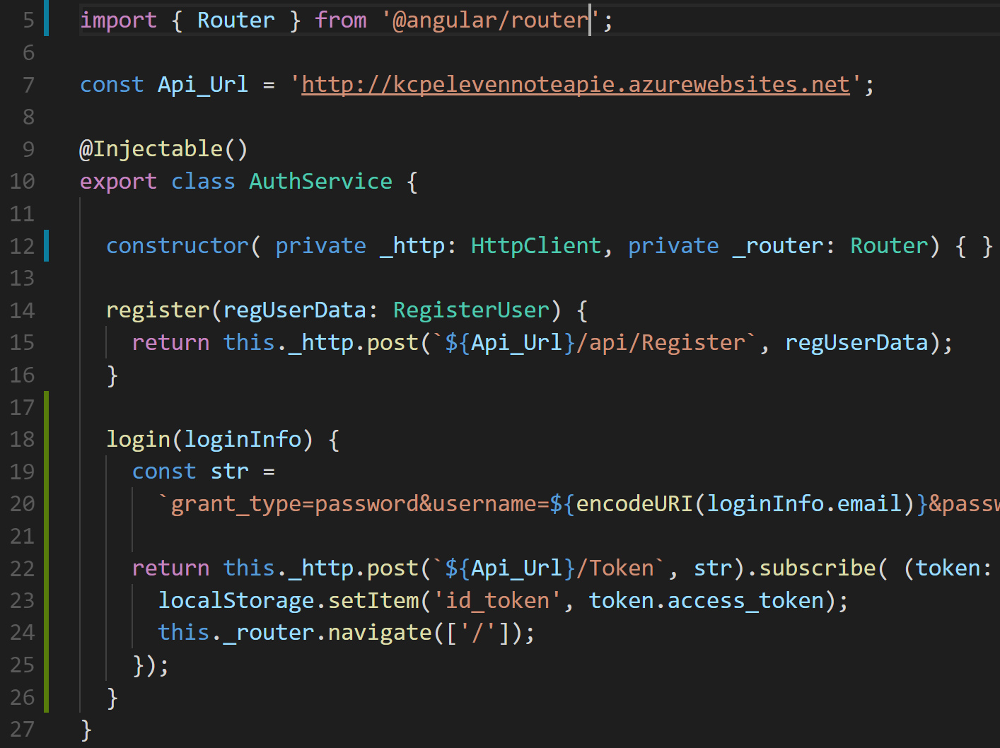
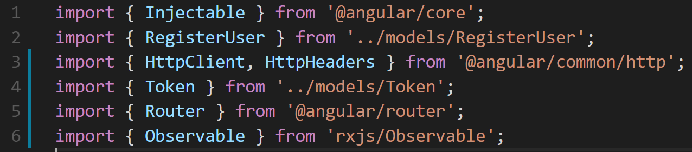
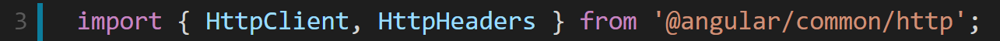
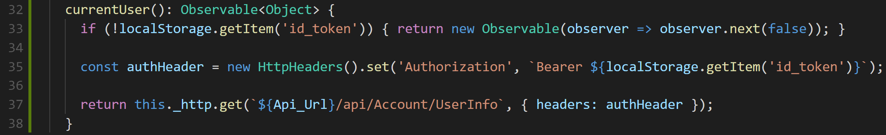
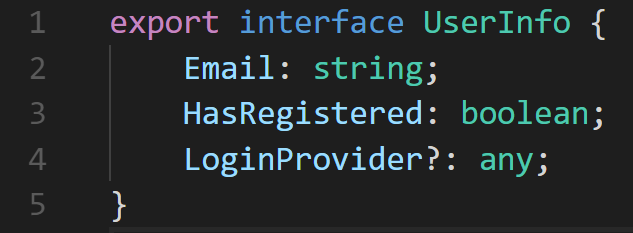
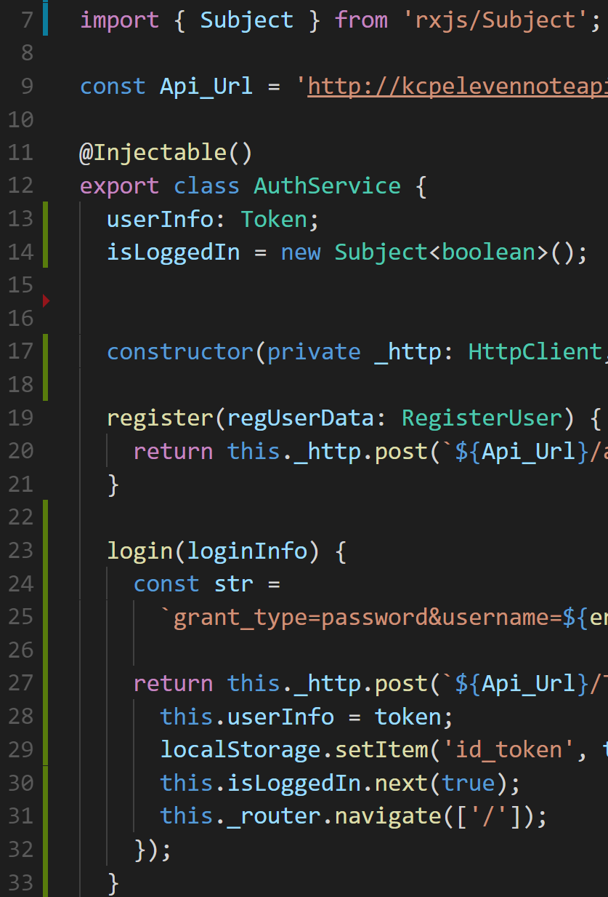
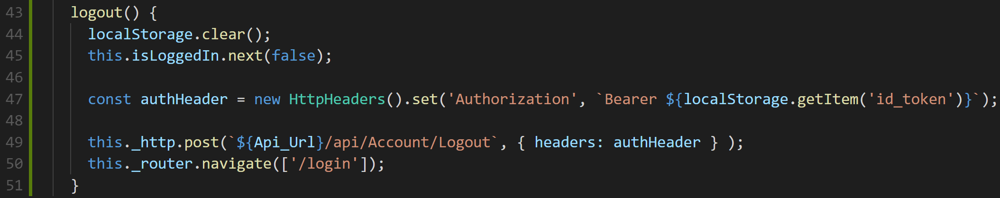
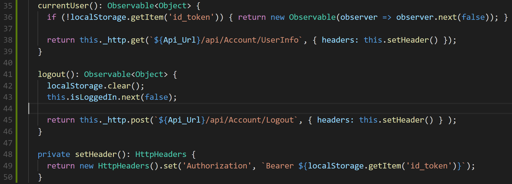

# Routing After a Request

##Step 1. Redirecting after Login Method

We just need to redirect after logging in. 

We can either do that in our **registration.component.ts** file after our login method, or the **auth.service.ts**. Let’s do it from our **auth.service.ts**.

We need to import Router from Angular’s library. Then in our **constructor** create an instance for it as a private variable. 

Then we can work with the **navigate()** method, that occurs after the token gets set to our **localStorage**.

Test out your app, right now any redirection takes us back to the register component, but we should not have any errors.

## Step 2. Storing our current user information

It’s nice to store some information about our user at this point. We have a way to register our user, a way for them to login. Now for user experience, we want to store some user info so we can show their username around our app.  

Like in the header after they login…

With our WebAPI, there is an endpoint for **UserInfo**, that returns us the current information of our user based on the **Token** that is applied to the header of the request.  To see what the endpoint and requirements of it visit [here](http://kcpelevennoteapie.azurewebsites.net/swagger/ui/index#!/Account/Account_GetUserInfo).

For us to make a call we need to grab that token that we saved to the browser's **localStorage** and include it in the **Authorization** property of the request. To read more about the Auth header property read here.

We are going to make use of **Angular’s HttpHeaders** class that is apart of our **HttpClientModule**, to build the Authorization property

First we need to import it next to our **HttpClient**,

Also, let’s go ahead and import **Observable** class from **rxjs**, we can use that for applying the types to our methods, as well as— what we will be doing with the **currentUser** method— creating our own **Observable** 

Let’s create our currentUser method,

In the first line of code, we check if there is a token currently in our **localStorage**, and if there isn’t we send create an **Observable** that emits ‘false’ — _Representing that there is not a current user_.

We create our **Authorization** header next and append our token that should be in the **localStorage**. 

Then, we end with making our get request to the **UserInfo** endpoint of our **WebAPI**.

## Step 3. Challenge: Create a UserInfo Model

Our Goal for this challenge is to recollect some good habits, of creating models from sources of data. 

Based on our WebAPI documentation on our UserInfo endpoint, Build a model as we have done before for the data that is coming from the database. 

Angin the purpose of the Challenge is to test yourself take a glance at the challenge first and if you're spinning more than 15 minutes, take a gander at the answers in the next step.

## Step 4. Challenge Answer 

We create a file in our models folder, called **UserInfo.ts** and then we build out the **interface**.

The purpose of using the interface keyword, it allows us to create and use UserInfo as a type that we can now refer to in our development. 

I should take time to say that you can also create classes as models. 

The use case for that is if you are planning on creating instances of the model somewhere. OR if you want to create methods in the class. 

Interfaces cannot have methods inside of them.

## Step 5. Create a Logged in Status

We are going to look at another class in the Rxjs Library, **Subject**. 

What is the difference from **Observables** and **Subjects**:

> “All sub­scribers to a sub­ject share the same exe­cu­tion of the sub­ject. i.e. when a sub­ject pro­duces data, all of its sub­scribers will receive the same data. This behav­ior is dif­fer­ent from observ­ables, where each sub­scrip­tion causes an inde­pen­dent exe­cu­tion of the observable. ”
>_**— Difference between Rxjs Subject and Observable [cite](http://javascript.tutorialhorizon.com/2017/03/23/rxjs-subject-vs-observable/)**_

With **Subjects**, if we were to subscribe to them, EVERY subscription will have the new value from the data that’s received. 

That action is what we need to create when creating our logged in status. 

We are going to start in our **auth.service.ts** file and create a member variable called **isLoggedIn**. The value type for this variable will be a **boolean**— because you are either logged in or you’re not, no in between. 

Then in our **login()** method we will send data to the subject by passing in **true**, underneath the **localStorage.set(...)** expression, on **line 30**.

## Step 6. Logging out

Finally let’s handle logging out of our application. We are going to start by creating a **logout()** method 

Our **WebAPI** comes packed with a logout endpoint, so we want to use that in our **logout()** method, read more about it [here](http://kcpelevennoteapie.azurewebsites.net/swagger/ui/index#!/Account/Account_Logout).

For users to logout of our application, we need to do a couple of things:

- Clear the localStorage
- Send false to our isLoggedIn variable
- Send a post request to our logout endpoint 

If we look at our **currentUser()** method, it also has the line of code that is on **line 47**.

Hmm… is that **DRY(Don’t Repeat Yourself)**? That is a question that we as developers have to ask ourselves when we notice similar code in multiple places. 

Let’s DRY up this bad boy. By creating a private method that includes only the header set expression. 

