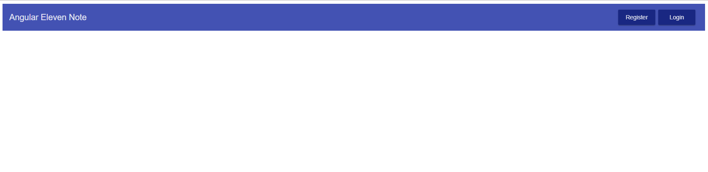

# Part 5: Routing with Angular Router

We will now start setting up routing in our application.

**Objectives:**

To use Angular Router to add Routing to our application. This way we will have different components display on different pages/urls. 

To read more about Angular Router visit [here](https://angular.io/guide/router).

## Step 1. Import Angular Router

We first need to import Angular Router into our **app.module.ts** file\(line 1 below\). 

Then, we will add the module to our imports on **line 28** right below our **FormsModule:**


Something to note in the app.module.ts file: we are keeping **angular modules** above the **material modules**. This is simply for the sake of organization.

## Step 2. Start Building paths

Now that we have Angular Router imported into our application, we are going to build out the paths for our components.

Since there are going to be multiple paths in our application, the way we can represent those paths is inside of an array of routes. 

Inside of **app.module.ts** let’s make a routes array that is going to collect all of our routes. Above the **@NgModule** decorator, type the variable:

```javascript
const routes = [];
```

A route will be an object that consists of a couple of properties, but the 2 we will focus on now are:

* Path, read more about Path [here](https://angular.io/guide/router#configuration). 
* Component, read more about Component [here](https://angular.io/guide/router#configuration).

How the path will look is like this:

```javascript
{ path: <appending url link>, component: <name of component> }
```

Let’s make a path for our register page inside of the array:


Next, we need to make sure that the **RouterModule** is built with our register route that we just created.

How do we do that? If we look at this link [here](https://angular.io/guide/router#configuration), we see that on our **RouterModule** in our decorator we have a method called **.forRoot\(\)**. To be clear, the following addition is made inside of the imports array at the end of the RouterModule that you just added to the import


## Step 3. Including router-outlet to show our paths

Okay, now that we have our router imported and a route configured, we now need a spot in our code that renders the output of our desired route.

That’s where the **router-outlet** [component directive](https://angular.io/guide/attribute-directives) comes in.

Let’s include it in our **app.component.html** file. We are going to remove the **app-registration** component directive and swap it out with our **router-outlet** component directive\(on the right below\). Let's also do some general clean up of the **app.component.html** file:


Now if we go back to our browser and check on our application, we see…



That’s right a whole bunch of nothing!

That’s because we are currently at the url of, [http://localhost:4200](http://localhost:4200).

But what happens when we go to the **/register** route at, [http://localhost:4200/register](http://localhost:4200/register) …

Boom! Magic… Well not magic, because you just saw how we’ve created this.

## Step 4. Challenge, Make any other route target our register component

Our goal for this challenge is to create a path that catches any link that we did not create, it will automatically take a user to the register page. So, if navigate to [http://localhost:4200](http://localhost:4200)/foo it would take you back to the register page.

_**\*Hint, take a look at this link and notice what Angular does does for routes that doesn’t exist,**_ [_**here**_](https://angular.io/guide/router#configuration)

## Step 5. Challenge Answer

The Answer to the challenge above is include the double asterisk as the path and for the component, we need to include the **RegistrationComponent:**


Now, when we go to any path it will redirect us to the Registration Component.

